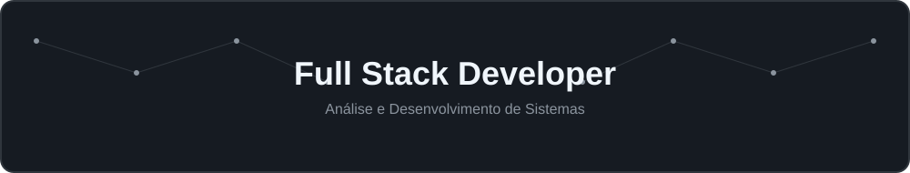
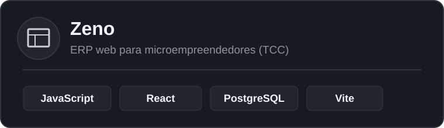
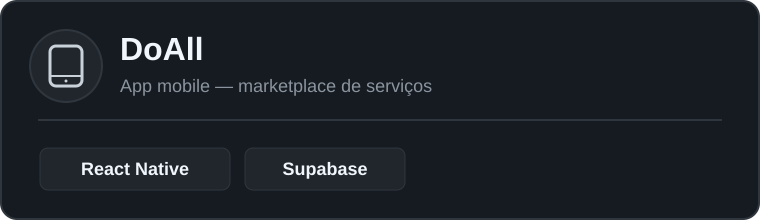
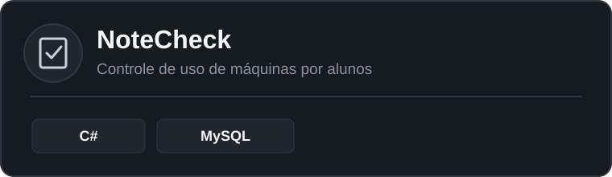
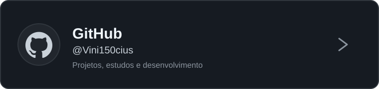

  

 

<table>
<tr>

<td width="100%" valign="middle">

### 👨‍💻 Sobre mim

## Olá, eu sou Vinicius

**Estudante de Análise e Desenvolvimento de Sistemas**

Sou estudante de Análise e Desenvolvimento de Sistemas na Fatec Itu, com interesse em desenvolvimento de software nas frentes web, mobile e desktop.

Gosto de transformar aprendizado em projetos práticos, evoluindo continuamente através dos estudos e das experiências adquiridas em cada projeto.

> **Construindo, aprendendo e evoluindo.**

</td>

</tr>
<tr>

<td width="100%" align="center">

<table style="border: none;">
<tr>
<td align="center" width="25%"><strong>📍 Itu - SP</strong></td>
<td align="center" width="25%"></td>
<td align="center" width="25%"></td>
<td align="center" width="25%"></td>
</tr>
</table>

</td>

</tr>
</table>

---

## Tecnologias e Ferramentas

 

<table>
<tr>

<td align="center" width="16.6%">
  
    
  <b>JavaScript</b>
</td>

<td align="center" width="16.6%">
  
    
  <b>TypeScript</b>
</td>

<td align="center" width="16.6%">
  
    
  <b>React</b>
</td>

<td align="center" width="16.6%">
  
    
  <b>Node.js</b>
</td>

<td align="center" width="16.6%">
  
    
  <b>Spring Boot</b>
</td>

</tr>
<tr>

<td align="center" width="16.6%">
  
    
  <b>MySQL</b>
</td>

<td align="center" width="16.6%">
  
    
  <b>PostgreSQL</b>
</td>

<td align="center" width="16.6%">
  
    
  <b>Firebase</b>
</td>

<td align="center" width="16.6%">
  
    
  <b>Docker</b>
</td>

</tr>
</table>

---

## Atualmente estudando

 

  
  &nbsp;
  
  &nbsp;
  

---

## Projetos em Destaque

 

<table>
<tr>

<td width="50%" align="center">

  

</td>

<td width="50%" align="center">

  

</td>

</tr>
<tr>

<td width="50%" align="center">

  

</td>

<td width="50%" align="center">

</td>

</tr>
</table>

---

## GitHub Stats

 

<table>
<tr>

<td>
  
</td>

<td>
  
</td>

</tr>
</table>

---

## Onde me encontrar

 

<table>
<tr>

<td width="50%" align="center">

  

</td>

<td width="50%" align="center">

  

</td>

</tr>
</table>

 

**Construindo hoje as habilidades para desenvolver as soluções de amanhã.**

